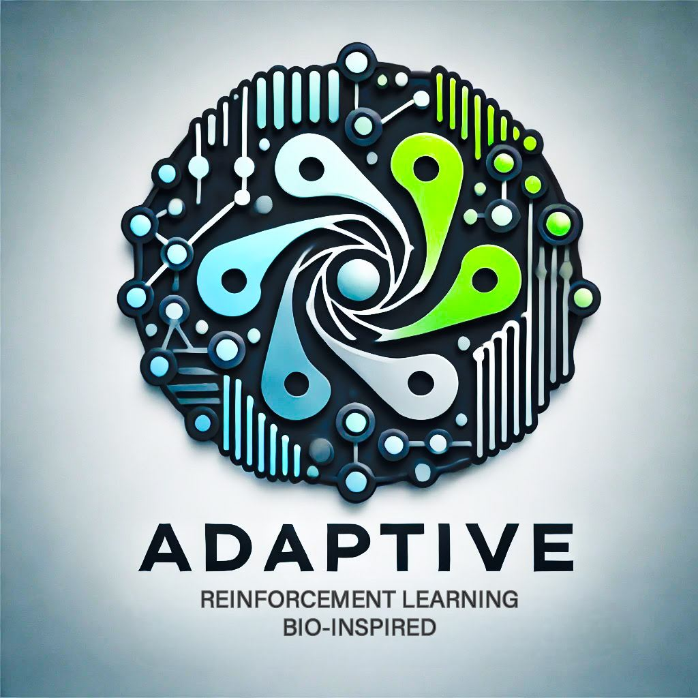

# Adaptive_RL
<div align="center">

</div>
Adaptive_RL is an open-source framework for implementing state-of-the-art Reinforcement Learning (RL) algorithms, 
designed to be modular and easily adaptable for different research and real-world applications. This repository has 
emphasis in Continuous space problems

Currently, the repository supports DDPG (Deep Deterministic Policy Gradient), SAC (Soft Actor-Critic), PPO (Proximal Policy Optimization),
and MPO (Maximum a Posteriori Optimization) with a flexible architecture that allows for the integration of new algorithms.

**Features:**

Replay Buffer and experience sampling to stabilize training.


Customizable neural network architectures for the actor and critic networks.


Modular framework allowing for easy extension to additional algorithms.
Comprehensive logging for training metrics and performance evaluation.

**Implemented Algorithms**
- DDPG: Suitable for environments requiring deterministic, high-precision control. Works well in tasks such as robotic
control or simulated physical systems.
- SAC: Best used in tasks requiring robust exploration, where a stochastic policy can adapt better to uncertain 
environments.
- MPO: Ideal for complex environments requiring a careful balance between policy stability and adaptability.
- PPO: Strikes a balance between performance and simplicity. It prevents large policy updates, stabilizing the 
learning process by clipping updates to the policy to keep changes within a fixed range, 
ensuring more stable and reliable training performance.

**CPG**

Development of a DRL framework in the MatsuokaOscillator Folder.

MatsuokaOscillator Directory created with multiple neurons and multiple oscillators implementation for oscillated
pattern movements. To be controlled by manual parameters or a DRL algorithm.


**Quickstart**

Clone the repository and install dependencies:
```
git clone https://github.com/YusseffRuiz/Adaptive_RL
cd Adaptive_RL
pip install -r requirements.txt
```

**How to use**

To train a new environment, everything can be run in main.py class.

Create the agent, specifying learning rates, however, they can be left for the default values:

**Example Usage**

To Run the SAC agent on the Mujoco Walker2d-v4 environment

```
import torch
import gymnasium as gym
import os
from Adaptive_RL import SAC


env_name = "Walker2d-v4"
env_name, save_folder, log_dir = trials.get_name_environment(env_name, algorithm="SAC", create=True,
                                                                 experiment_number=experiment_number)
agent = MPO_Algorithm.agents.SAC()
train_agent(agent=agent, environment=env_name)
```
or from the command line to run basic training with SAC:
```
python main.py
```

**Parallelization training via Multiprocess class.**

**Sequential:** Run environments in a for loop.

**Parallel:** Run different processes over either CPU or GPU, using multiprocess class.

**Hyperparameters**

| **Parameter**    | **Description**                                   | **Default Value** |
|------------------|---------------------------------------------------|-------------------|
| `lr_actor`       | Learning rate for the actor network               | 3e-4              |
| `lr_critic`      | Learning rate for the critic network              | 3e-4              |
| `gamma`          | Discount factor for future rewards                | 0.99              |
| `buffer_size`    | Size of the replay buffer                         | 1e6               |
| `batch_size`     | Batch size for updates                            | 256               |
| `entropy_coeff`  | Coefficient for entropy regularization (SAC only) | 0.2               |


**To Do:**

ARS implementation, analysing other state-of-the-art algorithms.

MyoSuite environment builder and algorithm adaptation for muscles and DoF.
At the moment, it can only interact with Gymnasium environments.

Automatic CPG adding into the environment. At the moment, CPG must be added into the env class.
Implementation must be directly into the RL class.

Development and Implementation of Hodgkin-Huxley neurons CPG. 

**Upcoming Features**
- Integration of Proximal Policy Optimization (PPO) and Trust Region Policy Optimization (TRPO).
- Enhanced support for discrete action spaces.

**Credit**

This repository is based on [Tonic RL](https://github.com/fabiopardo/tonic).
Based on Tonic RL Library and modified to match current Gymnasium implementation and for MyoSuite development.

Changes includes:
- Direct control over learning rates and neuron size.
- Usage of Sigmoid Linear Unit instead of Relu
- Simplification of classes.
